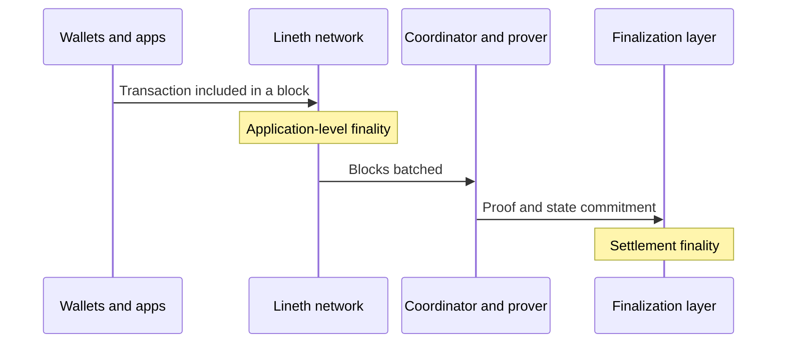

import GlossaryTerm from '@theme/GlossaryTerm';

This page describes when a transaction becomes final in a <GlossaryTerm term="Lineth" /> deployment: at block
production on the network (application-level finality), and when the matching state is verified on the
<GlossaryTerm term="Finalization layer">finalization layer</GlossaryTerm> (settlement finality).

How fast each one is, and what makes it irreversible, depends on <GlossaryTerm term="Maru validator">validator</GlossaryTerm>
topology, proof generation and submission, and the chosen finalization layer.

## Application-level and settlement finality

Finality is the point at which a transaction is immutable under the deployment's security assumptions.

- **Application-level finality** (or **soft finality**): The network has accepted the transaction as final.
  This happens when the configured validator model commits the block.
- **Settlement finality** (or **hard finality**): The matching state commitment has been verified and recorded
  on the finalization layer.

Every Lineth deployment produces blocks on the network and submits <GlossaryTerm term="zk-SNARK" /> proofs to a
finalization layer.
Application-level finality is what apps see at block production.
Settlement finality is what the finalization layer attests after proof verification.

### Application-level finality design

Application-level finality depends on the configured validator model.

| Validator model | When application-level finality is reached | Trust assumption |
| --- | --- | --- |
| Single Maru validator | When that validator produces and commits the block | The operator's sequencer is trusted. No consensus-driven forks or reorgs are expected by design |
| Multiple Maru validators ([QBFT](./distributed-sequencing.mdx)) | When a supermajority (≥2/3) of authorized validators commit the block, typically within seconds | Byzantine fault tolerance of the validator set (`n=3f+1`) |

A single-validator deployment prioritizes simplicity and low latency.
Use it when validator trust is explicit and a single sequencer is acceptable.
For example, [Linea Mainnet](../../network/index.mdx) uses a single validator.

A multi-validator deployment finalizes each block when the authorized validators commit it.
Use it when more than one party must participate in block ordering, or when the chain should keep producing blocks if one
validator fails.
For topology, latency, and setup, see [Multi-validator consensus](./distributed-sequencing.mdx).

**Block time** is an operator parameter on the Maru validator.
Choose block time and topology together so each block can be produced and committed in time.
A single validator produces the block alone, so block time must leave room for that validator's availability.
For example, [Linea Mainnet](../../network/index.mdx) uses 1-second blocks.
A multi-validator set must finish the QBFT commit within the block time; choose an interval based on network latency and
validator performance.

### Settlement finality design

Settlement finality is reached when the <GlossaryTerm term="Coordinator">coordinator</GlossaryTerm> has submitted the
proof, the finalization layer has verified it, and that layer has itself finalized the verification transaction.

The [finalization layer](./finalization-layer.mdx) choice changes settlement time and cost:

- Ethereum (L1): direct settlement on Ethereum; higher cost and longer finality.
- Linea Mainnet (L2): faster, cheaper settlement on Linea; the deployment also inherits Linea Mainnet's path to Ethereum.

[Data availability](./data-availability.mdx) does not change when settlement occurs.
It changes who can reconstruct history if they need the settled state.

## See also

- [Linea transaction finality](../../network/overview/transaction-finality.mdx): Soft and hard finality on Linea Mainnet.
- [Multi-validator consensus](./distributed-sequencing.mdx): How QBFT changes application-level finality and sequencer
  fault tolerance.
