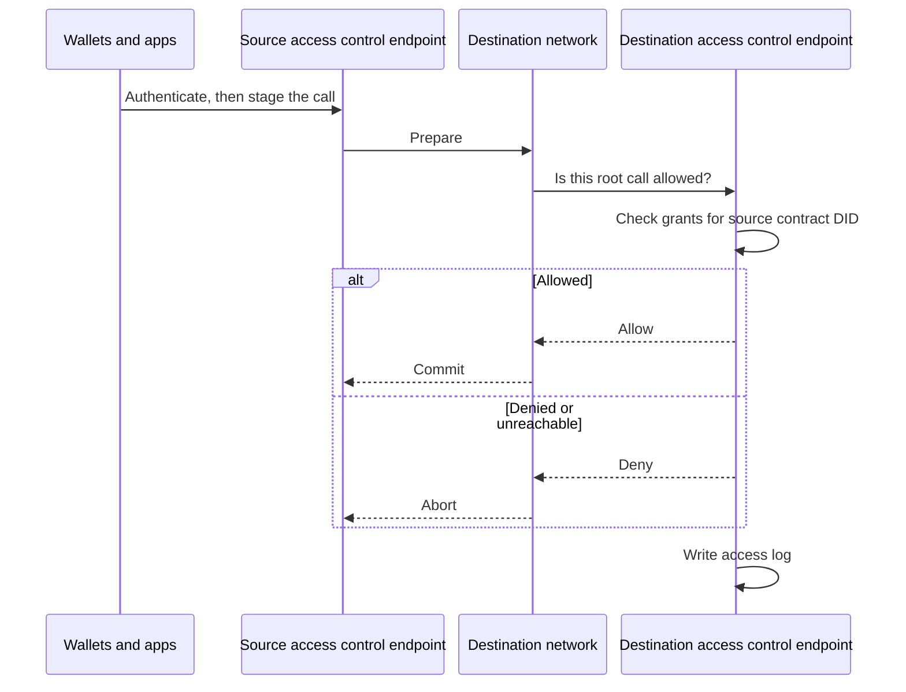

import GlossaryTerm from '@theme/GlossaryTerm';

This page describes **native interoperability** between two <GlossaryTerm term="Lineth" /> networks.
To communicate with each other, two [access controlled](access-control.mdx) (restricted) networks
coordinate a cross-chain call.
Each network runs the native interoperability plugin in its Lineth node.
There is no shared chain and no third-party bridge operator.

:::tip Lineth for institutions
Native interoperability is a proprietary feature for institutional and enterprise deployments.
To request access, use the
[strategic inquiries form](https://linea.build/contact/inquiries).
:::

:::note Other interoperability flows
Native interoperability refers to communication between two Lineth networks.
To communicate with a Lineth network's <GlossaryTerm term="Finalization layer">finalization layer</GlossaryTerm>,
use the [native bridge](../../protocol/architecture/interoperability/index.mdx).
To communicate with a non-Lineth network, use a bridge or relayer such as [Chainlink CCIP](https://docs.chain.link/ccip).
:::

## Native interoperability flow

Two restricted Lineth networks can communicate with each other as follows:

1. Operators of each network configure [role-based access control (RBAC)](./access-control.mdx)
   permissions for their network.
   They onboard organizations, groups, and users; and register the contracts those groups may use.
2. Each operator enables the native interoperability plugin on their Lineth node, deploys and
   registers the contracts it requires, and connects it to the peer network's node.
3. Each operator configures the plugin with the address of their access control endpoint, so it can
   ask the endpoint to evaluate the permissions of inbound cross-chain calls.
4. A user (or contract) from one network initiates a cross-chain call to the other network.
5. The two networks run a two-phase commit: **prepare**, then **commit** or **abort**.
   In the prepare phase, they simulate the call until both sides agree on the same result.
6. In the commit phase, the destination asks its access control endpoint whether that
   agreed call would be allowed as a live RPC request.
   The endpoint evaluates that caller against the destination's own RBAC policy.
   The subject is the source contract on the source chain, represented as a chain-based
   decentralized identifier (DID) such as `did:pkh:eip155:<source-chain>:<address>`;
   it is not `tx.origin` of the source transaction.
   If the endpoint allows the call, both sides commit.
   If it denies the call, or if the endpoint is unreachable, both sides abort.
7. The destination access control endpoint records the decision on its append-only
   access log.

:::warning Known limitation

Currently, the access control endpoint only evaluates the **root** cross-chain
call; nested calls made during execution on the destination are not separately
evaluated.

:::

:::info Trust assumptions

Each side checks that it included the agreed call and that both plugins computed the same
result from the exchanged simulation.
There is no shared proof across the two Lineth networks that replaces trust in the peer
operator and the peer endpoints you configured.

:::

## See also

- [Access control](./access-control.mdx): The access control stack for restricted deployments.
- [Native bridge](../../protocol/architecture/interoperability/index.mdx): Message service
  and token bridging to the finalization layer.
- [Trust and responsibilities](../evaluate/trust-model.mdx): What participants can verify
  in a Lineth deployment.
